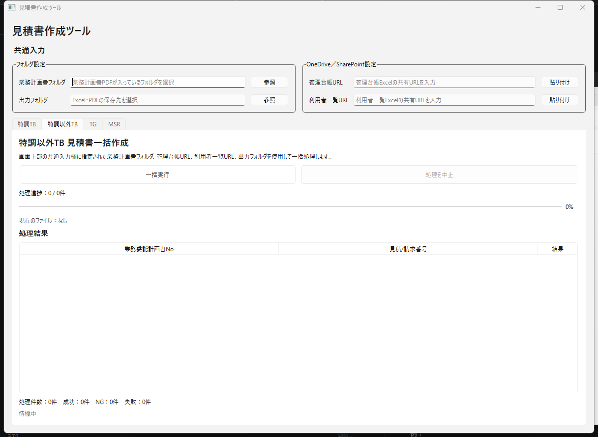
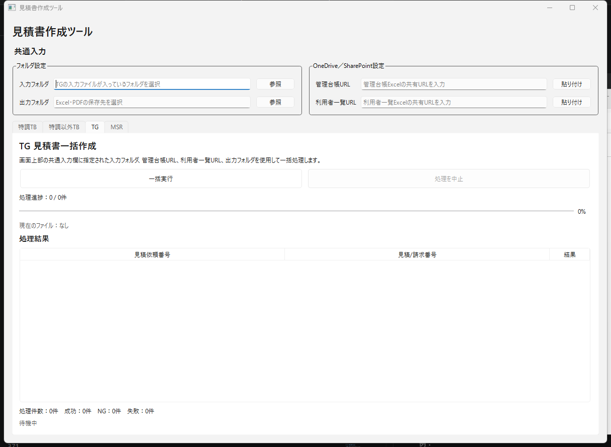
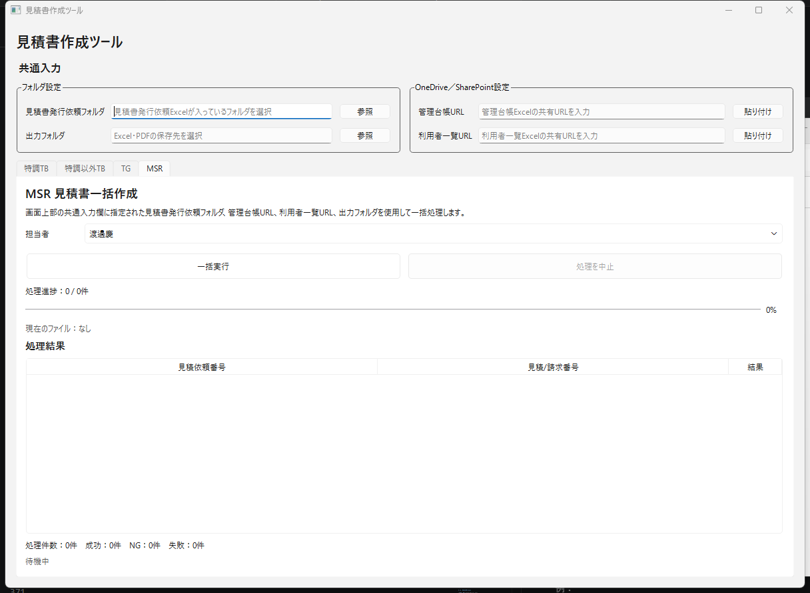

# 見積書作成ツール 操作手順書

---

## 1. はじめに

この手順書では、見積書作成ツールを初めて使用する方に向けて、次の内容を説明します。

- GitHubからツールを取得する方法
- ツールの起動方法
- 初回に必要な設定
- 各画面の見方
- 見積書を一括作成する方法
- エラーが発生した場合の確認方法

本ツールでは、入力フォルダに保存されているファイルをまとめて読み取り、次の処理を一括で行います。

- 入力ファイルの読み取り
- 見積書に必要な情報の抽出
- 見積書Excelの作成
- 見積書PDFの作成
- 管理台帳への登録
- 処理結果の一覧表示

基本的な操作は、必要なフォルダやURLを指定した後、**「一括実行」ボタンをクリックするだけ**です。

---

## 2. ツールで処理できる業務

画面上部のタブを切り替えることで、次の4種類の業務を処理できます。

| タブ名 | 処理する内容 |
|---|---|
| 特調TB | 特調TB案件の見積書を一括作成します |
| 特調以外TB | 特調以外TBの案件の見積書を一括作成します |
| TG | TG案件の見積書を一括作成します |
| MSR | MSR案件の見積書を一括作成し、管理台帳へ登録します |

処理したい案件に合ったタブを選択してください。

---

# 3. GitHubからツールを取得する

## 3.1 GitHubを開く

Microsoft EdgeやGoogle Chromeなどのブラウザを起動し、次のURLを開きます。

```text
https://github.com/Teru-Toshimori/estimate-app
```

GitHubへのログインを求められた場合は、アクセス権限を持っているGitHubアカウントでログインしてください。

---

## 3.2 `main` ブランチを確認する

GitHubの画面左上付近に表示されているブランチ名が、次の名前になっていることを確認します。

```text
main
```

別のブランチ名が表示されている場合は、ブランチ名をクリックして `main` を選択してください。

---

## 3.3 ZIPファイルをダウンロードする

GitHubの画面にある緑色の **「Code」** ボタンをクリックします。

表示されたメニューから、次の項目をクリックします。

```text
Download ZIP
```

ZIPファイルのダウンロードが始まります。

通常は、Windowsの「ダウンロード」フォルダに保存されます。

```text
C:\Users\ユーザー名\Downloads
```

---

## 3.4 ZIPファイルを展開する

ダウンロードした次のファイルを右クリックします。

```text
estimate-app-main.zip
```

表示されたメニューから、**「すべて展開」** をクリックします。

展開先を選択し、**「展開」** をクリックしてください。

保存先の例は次のとおりです。

```text
C:\EstimateTool
```

展開すると、次のようなフォルダが作成されます。

```text
C:\EstimateTool\estimate-app-main
```

---

# 4. ツールの保存場所を確認する

展開したフォルダを、次の順番で開きます。

```text
estimate-app-main
└── dist
    └── EstimateTool
```

`EstimateTool` フォルダ内に、次のファイルやフォルダがあることを確認します。

```text
EstimateTool
├── EstimateTool.exe
├── .env
└── resources
```

> [!IMPORTANT]
> `EstimateTool.exe` だけを別の場所へ移動しないでください。
>
> `.env` や `resources` フォルダも、ツールの動作に必要です。  
> 必ず `EstimateTool` フォルダごと使用してください。

---

# 5. 初回設定を確認する

## 5.1 `.env` ファイルについて

`.env` は、OpenAIやMicrosoft OneDrive／SharePointへ接続するための設定ファイルです。

配置場所は次のとおりです。

```text
dist\EstimateTool\.env
```

`.env` には、次の設定が記載されています。

```env
OPENAI_API_KEY=OpenAIのAPIキー

GRAPH_CLIENT_ID=Microsoft Entra IDのクライアントID
GRAPH_TENANT_ID=Microsoft Entra IDのテナントID
GRAPH_SCOPES=User.Read,Files.ReadWrite,Files.ReadWrite.All
```

通常、利用者が設定値を変更する必要はありません。

管理者から設定値を入力するよう案内された場合のみ、`.env` をメモ帳で開いて編集してください。

> [!CAUTION]
> `OPENAI_API_KEY` などの設定値は、外部へ公開しないでください。
>
> メール、チャット、スクリーンショットなどに設定値を載せないよう注意してください。

---

# 6. ツールを起動する

次のファイルをダブルクリックします。

```text
EstimateTool.exe
```

数秒待つと、**「見積書作成ツール」** の画面が表示されます。

---

## 6.1 Windowsの警告が表示された場合

初回起動時に、次のメッセージが表示される場合があります。

```text
WindowsによってPCが保護されました
```

その場合は、次の手順で起動します。

1. **「詳細情報」** をクリックします。
2. アプリ名が `EstimateTool.exe` であることを確認します。
3. **「実行」** をクリックします。

提供元が不明なファイルでは、この操作を行わないでください。

---

# 7. 画面全体の見方

ツールの画面は、大きく分けて次の5つの部分で構成されています。

1. 共通入力
2. 業務選択タブ
3. 一括実行・処理中止ボタン
4. 処理進捗
5. 処理結果

---

## 7.1 共通入力

画面上部の **「共通入力」** では、処理に使用するフォルダや管理台帳のURLを指定します。

共通入力の内容は、選択しているタブによって一部変わります。

### フォルダ設定

左側の「フォルダ設定」では、次の項目を指定します。

- 入力元となるフォルダ
- 作成した見積書の保存先フォルダ

### OneDrive／SharePoint設定

右側の「OneDrive／SharePoint設定」では、次のURLを入力します。

- 管理台帳URL
- 利用者一覧URL

URLは手入力するほか、クリップボードにコピーした状態で **「貼り付け」** ボタンをクリックして入力できます。

---

## 7.2 業務選択タブ

画面中央付近には、次のタブがあります。

```text
特調TB
特調以外TB
TG
MSR
```

処理したい業務に合わせてタブをクリックします。

タブを切り替えると、入力フォルダの名称や処理内容が切り替わります。

---

## 7.3 一括実行ボタン

必要な項目を入力した後、**「一括実行」** をクリックすると処理が開始されます。

一括実行では、入力フォルダに保存されている対象ファイルを順番に処理します。

処理内容には、次の作業が含まれます。

- 対象ファイルの検索
- PDFまたはExcelの読み取り
- 必要情報の抽出
- 管理台帳の検索
- 見積書Excelの作成
- 見積書PDFの作成
- 管理台帳への登録
- 処理結果の表示

処理途中で、利用者が個別に「出力」や「台帳登録」を行う必要はありません。

---

## 7.4 処理を中止ボタン

処理中は、**「処理を中止」** ボタンが使用できる状態になります。

処理を途中で止める場合にクリックします。

> [!WARNING]
> 処理を中止した場合、中止する前に処理が完了していたファイルは、すでに出力や台帳登録が行われている可能性があります。
>
> 再実行する前に、出力フォルダと管理台帳を確認してください。

---

## 7.5 処理進捗

処理中は、画面に次の情報が表示されます。

- 処理済み件数
- 処理対象の合計件数
- 現在処理しているファイル
- 進捗率
- プログレスバー

表示例：

```text
処理進捗：3 / 10件
現在のファイル：ITK14642.pdf
30%
```

処理が完了するまで、ツールを閉じたり、対象ファイルを移動したりしないでください。

---

## 7.6 処理結果

画面下部の「処理結果」には、ファイルごとの処理結果が一覧表示されます。

表示される項目は、選択しているタブによって異なります。

例：

| 項目 | 内容 |
|---|---|
| 伝票番号 | 特調TB案件の伝票番号 |
| 業務委託計画書No | 特調以外TBの業務委託計画書番号 |
| 見積依頼番号 | TG・MSR案件の見積依頼番号 |
| 見積／請求番号 | 作成または取得した見積番号 |
| 結果 | 成功、NG、失敗などの処理結果 |

画面下部には、全体の集計も表示されます。

```text
処理件数：0件
成功：0件
NG：0件
失敗：0件
```

---

# 8. 特調TBの操作方法


**図1：特調TB画面**

特調TBでは、業務計画書PDFを読み取り、見積書の作成と管理台帳への登録を一括で行います。

---

## 8.1 特調TBタブを選択する

画面中央にある **「特調TB」** タブをクリックします。

画面に次の見出しが表示されていることを確認します。

```text
特調TB 見積書一括作成
```

---

## 8.2 業務計画書フォルダを選択する

「業務計画書フォルダ」の右側にある **「参照」** をクリックします。

フォルダ選択画面が表示されたら、処理対象となる業務計画書PDFが入っているフォルダを選択します。

フォルダ内には、処理したいPDFを保存してください。

例：

```text
業務計画書フォルダ
├── ITK14642.pdf
├── ITK14643.pdf
└── ITK14758.pdf
```

> [!IMPORTANT]
> フォルダ内に処理対象ではないPDFが入っていないことを確認してください。

---

## 8.3 出力フォルダを選択する

「出力フォルダ」の右側にある **「参照」** をクリックします。

見積書ExcelとPDFを保存するフォルダを選択してください。

例：

```text
C:\EstimateTool\output
```

---

## 8.4 管理台帳URLを入力する

OneDriveまたはSharePointで管理している、管理台帳Excelの共有URLを入力します。

事前にブラウザなどで共有URLをコピーしておき、**「貼り付け」** をクリックすると簡単に入力できます。

入力欄：

```text
管理台帳URL
```

---

## 8.5 利用者一覧URLを入力する

利用者一覧Excelの共有URLを入力します。

共有URLをコピーし、右側の **「貼り付け」** をクリックしてください。

入力欄：

```text
利用者一覧URL
```

---

## 8.6 一括実行する

次の4項目が入力されていることを確認します。

- 業務計画書フォルダ
- 出力フォルダ
- 管理台帳URL
- 利用者一覧URL

問題がなければ、**「一括実行」** をクリックします。

確認画面が表示された場合は、処理内容を確認して **「実行」** をクリックしてください。

---

## 8.7 処理完了を確認する

処理が完了すると、処理結果に次の情報が表示されます。

- 伝票番号
- 見積／請求番号
- 結果

画面下部の成功件数や失敗件数も確認してください。

出力フォルダを開き、ExcelとPDFが作成されていることを確認します。

---

# 9. 特調以外TBの操作方法



**図2：特調以外TB画面**

特調以外TBでは、業務委託計画書を読み取り、見積書の作成と管理台帳への登録を一括で行います。

---

## 9.1 特調以外TBタブを選択する

画面中央にある **「特調以外TB」** タブをクリックします。

次の見出しが表示されていることを確認してください。

```text
特調以外TB 見積書一括作成
```

---

## 9.2 共通入力を設定する

次の項目を入力します。

| 項目 | 入力する内容 |
|---|---|
| 業務計画書フォルダ | 業務計画書PDFが入っているフォルダ |
| 出力フォルダ | ExcelとPDFの保存先 |
| 管理台帳URL | 管理台帳Excelの共有URL |
| 利用者一覧URL | 利用者一覧Excelの共有URL |

各フォルダは **「参照」** から選択します。

各URLは、共有URLをコピーして **「貼り付け」** をクリックします。

---

## 9.3 一括実行する

必要な項目が入力されていることを確認し、**「一括実行」** をクリックします。

処理中は、進捗や現在処理しているファイルが画面に表示されます。

---

## 9.4 処理結果を確認する

処理結果には、次の項目が表示されます。

- 業務委託計画書No
- 見積／請求番号
- 結果

処理完了後は、出力フォルダと管理台帳の内容を確認してください。

---

# 10. TGの操作方法



**図3：TG画面**

TGでは、入力フォルダに保存されているTG用ファイルを読み取り、次の処理を一括で行います。

- PDF解析
- 必要情報の抽出
- 管理台帳への記入
- 見積書Excelの作成
- 見積書PDFの作成

---

## 10.1 TGタブを選択する

画面中央の **「TG」** タブをクリックします。

次の見出しが表示されていることを確認します。

```text
TG 見積書一括作成
```

---

## 10.2 入力フォルダを選択する

「入力フォルダ」の右側にある **「参照」** をクリックします。

TGの入力ファイルが保存されているフォルダを選択してください。

入力欄には、次の案内が表示されています。

```text
TGの入力ファイルが入っているフォルダを選択
```

---

## 10.3 出力フォルダを選択する

「出力フォルダ」の右側にある **「参照」** をクリックします。

作成したExcelとPDFを保存するフォルダを選択します。

---

## 10.4 管理台帳URLを入力する

管理台帳Excelの共有URLを入力します。

URLをコピーした後、**「貼り付け」** をクリックしてください。

---

## 10.5 利用者一覧URLを入力する

利用者一覧Excelの共有URLを入力します。

URLをコピーした後、**「貼り付け」** をクリックしてください。

---

## 10.6 一括実行する

次の項目が設定されていることを確認します。

- 入力フォルダ
- 出力フォルダ
- 管理台帳URL
- 利用者一覧URL

問題がなければ、**「一括実行」** をクリックします。

TGではPDF解析を行うため、ファイルの数や容量によって処理に時間がかかる場合があります。

処理完了まで、そのままお待ちください。

---

## 10.7 処理結果を確認する

処理結果には、次の項目が表示されます。

- 見積依頼番号
- 見積／請求番号
- 結果

失敗またはNGになったファイルがある場合は、対象ファイル名とエラーメッセージを確認してください。

---

# 11. MSRの操作方法



**図4：MSR画面**

MSRでは、見積書発行依頼Excelを読み取り、見積書作成から管理台帳への登録までを一括で行います。

---

## 11.1 MSRタブを選択する

画面中央の **「MSR」** タブをクリックします。

次の見出しが表示されていることを確認します。

```text
MSR 見積書作成
```

---

## 11.2 見積書発行依頼フォルダを選択する

「見積書発行依頼フォルダ」の右側にある **「参照」** をクリックします。

見積書発行依頼Excelが保存されているフォルダを選択してください。

入力欄には、次の案内が表示されています。

```text
見積書発行依頼Excelが入っているフォルダを選択
```

---

## 11.3 出力フォルダを選択する

「出力フォルダ」の右側にある **「参照」** をクリックします。

作成したExcelとPDFを保存するフォルダを選択してください。

---

## 11.4 管理台帳URLを入力する

管理台帳Excelの共有URLを入力します。

共有URLをコピーし、**「貼り付け」** をクリックしてください。

---

## 11.5 利用者一覧URLを入力する

利用者一覧Excelの共有URLを入力します。

共有URLをコピーし、**「貼り付け」** をクリックしてください。

---

## 11.6 担当者を選択する

MSRでは、処理を実行する前に担当者を選択します。

「担当者」の右側にある選択欄をクリックし、一覧から担当者を選択してください。

例：

```text
渡邉慶
```

担当者の選択内容は、管理台帳への登録先や出力内容に使用されます。

> [!IMPORTANT]
> 担当者を間違えると、誤った担当者の欄に情報が登録される可能性があります。
>
> 一括実行前に、担当者名を必ず確認してください。

---

## 11.7 一括実行する

次の項目が正しく設定されていることを確認します。

- 見積書発行依頼フォルダ
- 出力フォルダ
- 管理台帳URL
- 利用者一覧URL
- 担当者

問題がなければ、**「一括実行」** をクリックします。

見積書の作成と管理台帳への登録が自動で行われます。

---

## 11.8 処理結果を確認する

処理結果には、次の項目が表示されます。

- 見積依頼番号
- 見積／請求番号
- 結果

処理が完了したら、次の内容を確認してください。

- 出力フォルダにExcelが作成されている
- 出力フォルダにPDFが作成されている
- 正しい担当者の管理台帳へ登録されている
- 見積依頼番号が正しい
- 見積／請求番号が正しい

---

# 12. 一括実行中の注意事項

一括実行中は、次の操作を行わないでください。

- ツールを終了する
- パソコンをシャットダウンする
- 入力フォルダ内のファイルを移動または削除する
- 出力フォルダを移動または削除する
- 処理対象のExcelファイルを開く
- 管理台帳をExcelで直接編集する
- インターネット接続を切断する

処理中は「現在のファイル」に、処理対象のファイル名が表示されます。

処理が完了し、画面下部に完了状態が表示されるまでお待ちください。

---

# 13. 処理結果の見方

処理結果は、画面下部の一覧と集計欄で確認します。

## 13.1 成功

正常に見積書の作成と管理台帳への登録が完了した状態です。

```text
成功
```

出力フォルダにExcelとPDFがあることを確認してください。

---

## 13.2 NG

入力ファイルの内容不足や、業務上の確認が必要な状態です。

```text
NG
```

対象ファイルと表示内容を確認し、必要に応じて入力ファイルを修正してください。

---

## 13.3 失敗

ファイルの読み取り、見積書作成、管理台帳更新などでエラーが発生した状態です。

```text
失敗
```

エラーメッセージを確認し、原因を修正してから再実行してください。

---

# 14. 出力されたファイルを確認する

一括実行が完了したら、指定した出力フォルダを開きます。

作成されたExcelとPDFを開き、次の内容を確認してください。

- 宛先
- 担当者
- 件名
- 見積依頼番号
- 伝票番号
- 見積／請求番号
- 発行日
- 成果物
- 金額
- 納期
- ファイル名

> [!IMPORTANT]
> ツールの処理が成功していても、提出前には必ず内容を目視確認してください。

---

# 15. よくある問題と対処方法

## 15.1 「一括実行」を押せない

必要な項目が入力されていない可能性があります。

次の内容を確認してください。

- 入力フォルダを選択している
- 出力フォルダを選択している
- 管理台帳URLを入力している
- 利用者一覧URLを入力している
- MSRの場合は担当者を選択している

---

## 15.2 入力フォルダにファイルが見つからない

次の内容を確認してください。

- 正しいフォルダを選択している
- 対象のPDFまたはExcelがフォルダ内にある
- ファイルが別のサブフォルダに入っていない
- ファイルの拡張子が正しい
- OneDriveのファイルが「オンラインのみ」になっていない

OneDrive上のファイルの場合は、ファイルを右クリックして次を選択します。

```text
このデバイス上で常に保持する
```

---

## 15.3 管理台帳へ接続できない

次の内容を確認してください。

- インターネットに接続されている
- 管理台帳URLが正しい
- URLの前後に不要な空白が入っていない
- 対象の管理台帳へのアクセス権限がある
- 正しいMicrosoftアカウントでログインしている
- `.env` のMicrosoft Graph設定が正しい

---

## 15.4 利用者一覧を取得できない

次の内容を確認してください。

- 利用者一覧URLが正しい
- 利用者一覧Excelが削除または移動されていない
- 対象ファイルへの閲覧権限がある
- SharePointまたはOneDriveへログインできる

---

## 15.5 TGのPDF解析に失敗する

次の内容を確認してください。

- インターネットに接続されている
- PDFが破損していない
- PDFにパスワードが設定されていない
- `.env` にOpenAI APIキーが設定されている
- 入力フォルダに対象外のファイルが入っていない

---

## 15.6 ExcelまたはPDFを出力できない

次の内容を確認してください。

- 出力フォルダへの書き込み権限がある
- 同じ名前のExcelを開いていない
- 同じ名前のPDFを別のアプリで開いていない
- 出力フォルダが削除または移動されていない
- パソコンの空き容量が不足していない

---

## 15.7 処理が途中で止まった

画面の「現在のファイル」を確認してください。

同じファイルで長時間止まっている場合は、必要に応じて **「処理を中止」** をクリックします。

中止後は、次の内容を確認してください。

1. 処理結果一覧
2. 出力フォルダ
3. 管理台帳
4. 問題が発生した入力ファイル

確認後、問題のあるファイルを修正して再実行してください。

---

# 16. ツールを終了する

すべての処理が完了していることを確認します。

画面右上の **「×」** をクリックしてツールを終了してください。

処理中に終了すると、ExcelやPDFの作成、管理台帳への登録が途中になる可能性があります。

---

# 17. 最新版へ更新する

GitHubからZIP形式で取得した場合は、次の手順で最新版へ更新します。

1. GitHubのリポジトリを開きます。
2. ブランチが `main` であることを確認します。
3. 「Code」をクリックします。
4. 「Download ZIP」をクリックします。
5. ZIPファイルを展開します。
6. 以前のバージョンとは別のフォルダへ保存します。
7. 必要に応じて、管理者の指示に従って `.env` を設定します。
8. 新しい `EstimateTool.exe` を起動します。

> [!WARNING]
> 古いフォルダへそのまま上書きすると、設定ファイルや出力ファイルが失われる場合があります。
>
> 新しいバージョンは、別のフォルダへ展開して動作確認してください。

---

# 18. 管理者へ問い合わせる場合

問題が解決しない場合は、次の情報を管理者へ伝えてください。

- エラーが発生した日時
- 使用していたタブ
- 選択した入力フォルダ
- 表示されたエラーメッセージ
- 処理結果の「結果」欄
- 「現在のファイル」に表示されていたファイル名
- エラー画面のスクリーンショット
- ツールをダウンロードした日
- Windowsのバージョン

スクリーンショットを撮影する場合は、次の情報が映らないように注意してください。

- OpenAI APIキー
- Microsoft Graphの設定値
- パスワード
- 個人情報
- 社外秘情報

---

# 19. 操作の簡単な流れ

各タブに共通する基本操作は、次のとおりです。

```text
1. 使用するタブを選択する
        ↓
2. 入力フォルダを選択する
        ↓
3. 出力フォルダを選択する
        ↓
4. 管理台帳URLを貼り付ける
        ↓
5. 利用者一覧URLを貼り付ける
        ↓
6. MSRの場合は担当者を選択する
        ↓
7. 「一括実行」をクリックする
        ↓
8. 処理が完了するまで待つ
        ↓
9. 処理結果を確認する
        ↓
10. 出力されたExcel・PDFと管理台帳を確認する
```

基本的には、必要な項目を設定して **「一括実行」** をクリックすれば、見積書作成から管理台帳への登録まで自動で行われます。